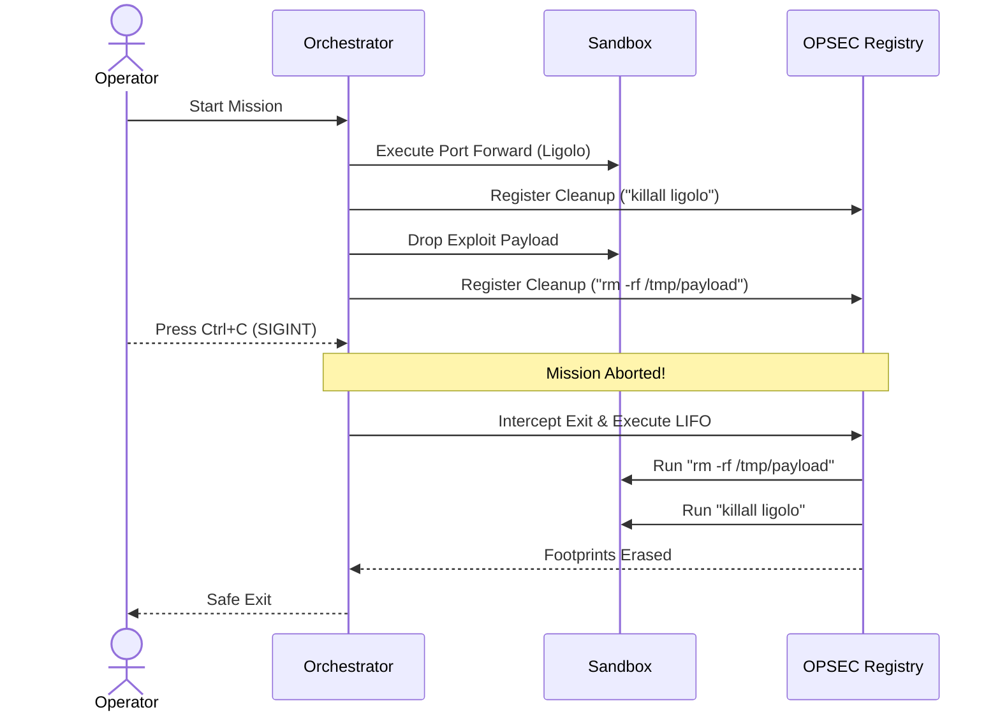

# DrogonClaw Architecture

DrogonClaw is an autonomous, offensive Red Team agent designed to execute full-chain exploitation against target infrastructure. Unlike simple reconnaissance wrappers, DrogonClaw is built around an unrestricted execution engine, allowing it to think, compile tools on the fly, and pivot dynamically.

## Core Architectural Components

### 1. The Orchestrator (ReAct Engine)
DrogonClaw's brain is driven by a custom, hyper-fast Go-based ReAct (Reasoning & Acting) loop. The Orchestrator (`internal/agent/orchestrator.go`) binds the chosen LLM (OpenRouter, NVIDIA NIM, OpenAI, Google Gemini, or a local Ollama model) to a suite of offensive security tools. 
- The Orchestrator does not use artificial constraints or execution cages. 
- It uses a **Mission Planner** to generate a tactical execution graph before beginning.
- It leverages an **Evidence Validator** to double-check tool outputs and prevent LLM hallucinations.
- Concurrency is achieved natively via **Swarm Commander**, using OS-level Goroutines to execute parallel attack vectors (`internal/agent/swarm.go`).

### 2. The Unrestricted Sandbox
DrogonClaw executes shell commands via an isolated, root-privileged Docker sandbox (`internal/sandbox/docker.go`).
- **No Allowlist:** The agent can run `apt-get install`, use `gcc` to compile custom C payloads, or drop into Python.
- **Stateful Shell:** Network interfaces, routing tables, and dropped files persist across tool calls within the same session.

### 3. The Loot Database (Decoupled Memory)
To prevent context-window exhaustion during massive reconnaissance (e.g., parsing 10,000 subdomains), DrogonClaw uses an asynchronous SQLite database (`drogonclaw_loot.db`).
- Bulky scans are piped into the database using the `store_loot` tool.
- The agent can query specific subnets or credentials using the `query_loot` tool.
- This decoupling allows DrogonClaw to maintain focus on the tactical plan without forgetting crucial details.

### 4. The OPSEC Cleanup Registry
Stealth and professionalism are guaranteed by the `CleanupRegistry`.
- Whenever a tool modifies the filesystem or spawns a background proxy, it registers a reverse-action shell command.
- If the operator aborts the mission (e.g., `SIGINT`), the engine intercepts the exit, executes all cleanup commands in reverse-order (LIFO), and removes all traces before safely dying.

## Execution Modes

1. **Manual Mode:** The Orchestrator strictly enforces Human-in-the-Loop (HitL) authorization. Before running an aggressive exploit or dropping a payload, the agent will pause and prompt the user via the `ask_operator` tool.
2. **Autopilot Overdrive:** HitL is disabled. The agent will run relentlessly, chaining exploits, pivoting via Ligolo, and attempting to reach the final objective autonomously.

*Built for absolute destruction.*
