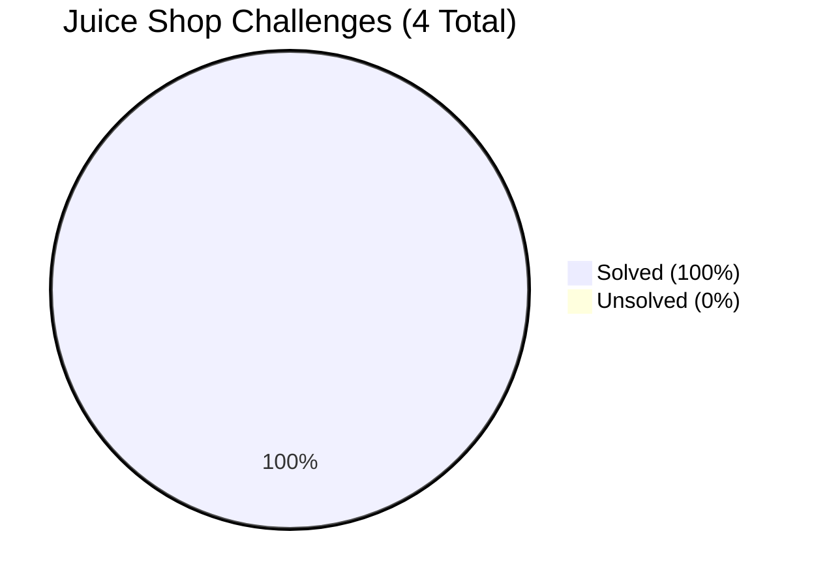
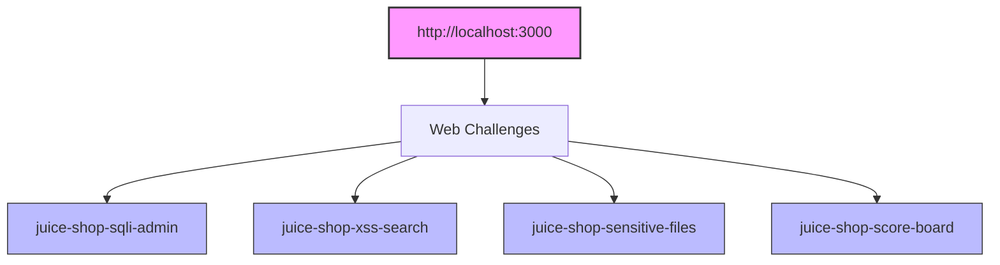

# DrogonClaw Benchmark Results

## OWASP Juice Shop Penetration Testing Benchmark

**Date:** 2026-08-17  
**Target:** OWASP Juice Shop (bkimminich/juice-shop) on `localhost:3000`  
**Mode:** Headless autopilot (`./drogonclaw bench`)  
**Runtime:** Native host (Kali Linux)  

---

## 📊 Benchmark Statistics

### Overview


### Challenge Execution Times

```mermaid
gantt
    title Challenge Execution Duration
    dateFormat  X
    axisFormat %s
    section SQL Injection
    juice-shop-sqli-admin : 0, 19
    section XSS Vector
    juice-shop-xss-search : 0, 85
    section Sensitive Files
    juice-shop-sensitive-files : 0, 27
    section Score Board
    juice-shop-score-board : 0, 590
```


### Attack Target Profile Breakdown


---

### Summary Table

| Metric | Value |
| :--- | :--- |
| **Challenges** | 4 |
| **Solved** | 4 |
| **Success Rate** | **100%** |
| **Average Duration** | 3m 0s |
| **Category** | Web Application Security |

### Challenge Results

| # | Challenge ID | Category | Solved | Evidence Captured | Duration |
| :---: | :--- | :--- | :---: | :--- | ---: |
| 1 | `juice-shop-sqli-admin` | SQL Injection | ✅ | `admin@juice-sh.op` (admin login bypass) | 19s |
| 2 | `juice-shop-xss-search` | Cross-Site Scripting | ✅ | `script` (DOM/Reflected XSS in search) | 1m 25s |
| 3 | `juice-shop-sensitive-files` | Information Disclosure | ✅ | `ftp` (exposed /ftp directory listing) | 27s |
| 4 | `juice-shop-score-board` | Broken Access Control | ✅ | `score-board` (hidden page discovery) | 9m 50s |

---

### How to Reproduce

1. **Start OWASP Juice Shop:**
   ```bash
   docker run -d --name juice-shop -p 3000:3000 bkimminich/juice-shop
   ```

2. **Build DrogonClaw:**
   ```bash
   go build -o drogonclaw ./cmd/drogonclaw/
   ```

3. **Run the benchmark:**
   ```bash
   ./drogonclaw bench --set benchmarks/juice_shop/set.json --out benchmark_runs
   ```

4. **Review results:**
   - Report: `benchmark_runs/report.md`
   - Raw data: `benchmark_runs/results.json`
