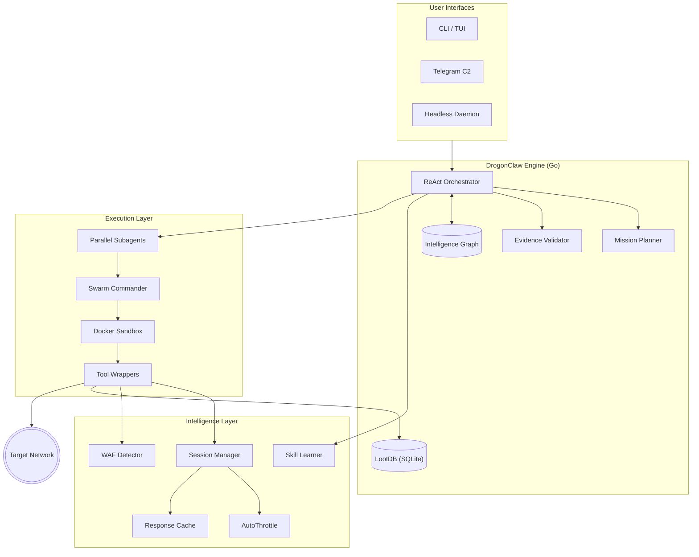

# DrogonClaw

<div align="center">
  
</div>

<div align="center">

[](https://github.com/0xP4X/drogonclaw/actions/workflows/CI-CD.yml)
[](LICENSE)
[](https://go.dev)
[](docs/INDEX.md)
[](docker-compose.yml)
[](SECURITY.md)

</div>

> **Autonomous AI-Powered Penetration Testing Platform**

DrogonClaw is an autonomous AI agent that plans, executes, and adapts penetration tests against target infrastructure. It operates as a **ReAct-based intelligence core** with persistent memory, parallel subagents, learned attack patterns, and sandboxed tool execution.

[Quick Start](#quick-start) | [Capabilities](#capabilities) | [Architecture](#architecture) | [Tools](docs/TOOLS.md) | [Commands](#commands) | [Development](#development) | [Setup Guide](docs/setup.md)

---

## Warning

> [!WARNING]
> **Linux Only — Authorized Testing Only**
> DrogonClaw is designed for **Linux-based operating systems** (Kali, Ubuntu, Debian). It relies on Linux-specific networking APIs, filesystem permissions, and process management. **Never** use it against systems without explicit written authorization.

---

## Capabilities

### Core Engine
- **ReAct Orchestration** — Hand-rolled Go reasoning loop (no Node.js/LangChain overhead) with mission planning, evidence verification, and self-correction.
- **Persistent Intelligence Graph** — JSON-backed memory storing targets, assets, ports, services, vulnerabilities, credentials, and flags with typed relationships.
- **Sandboxed Execution** — Docker-isolated tool execution with host fallback that fails closed.
- **Structured Tool Wrappers** — Typed wrappers for 10+ pentest tools with best-practice flag defaults.

### Intelligence & Exploitation
- **7-State Exploit Parser** — Every exploit attempt classified into actionable states: `SUCCESS_SHELL`, `SUCCESS_SILENT`, `PATCHED`, `FILTERED`, `WRONG_ARCH`, `AUTH_REQUIRED`, `CRASHED`.
- **Verified Exploit Templates** — Pre-compiled chains for critical CVEs (EternalBlue, Log4Shell, PrintNightmare, MS08-067, Spring4Shell).
- **Active Directory Arsenal** — Impacket/BloodHound wrappers (Kerberoasting, Pass-the-Hash, DCSync).
- **Dual-Layer CVE Intelligence** — Rolling 120-day NVD cache + offline database of 100 classic CTF/pentest CVEs.
- **Binary Triage** — Automated `checksec`, `strings`, `nm`, `gdb` fed into LLM context.

### New Capabilities (Scrapling + Hermes Inspired)
- **Session Persistence** — Persistent cookie jars per domain. Login once, enumerate everything across tool calls. ([docs/SESSION_MANAGEMENT.md](docs/SESSION_MANAGEMENT.md))
- **Adaptive Rate Limiting (AutoThrottle)** — Per-domain rate control that speeds up when targets allow and backs off on 429/503. Respects `Retry-After` headers.
- **Response Caching** — Tool responses cached to disk for retry without re-hitting targets.
- **WAF Detection & Bypass Hints** — Detects Cloudflare, Akamai, AWS WAF, ModSecurity, Imperva, Sucuri with actionable bypass guidance.
- **Skill Learning** — After verified successes, techniques are saved as reusable skills. Future targets get automatically matched against learned patterns. ([docs/SKILL_LEARNING.md](docs/SKILL_LEARNING.md))
- **Parallel Subagents** — Independent recon/exploitation tasks run concurrently with dependency-aware scheduling. 3-5x faster recon. ([docs/SUBAGENTS.md](docs/SUBAGENTS.md))

### Safety & Control
- **Human-in-the-Loop (HitL)** — Dangerous actions halt for operator approval with tiered risk levels.
- **Autonomous Code Gates** — Script execution, ghost tools, and reverse shells always require approval.
- **Prompt Injection Defense** — External tool outputs sanitized before LLM context injection.
- **Dynamic Skill Denylist** — 21 patterns blocked (reverse shells, `curl|sh`, `chmod 777`, etc.).
- **Memory Failure Loops** — Failed command syntax tracked globally; agent cannot repeat the same mistake.

### Interfaces
- **TUI** — Professional terminal interface with sidebar, status bar, command palette (Ctrl+P), leader key system (Ctrl+X).
- **Telegram C2 Gateway** — Remote mobile control via Telegram bot.
- **Headless Daemon** — Runs without terminal for automated scanning.

---

## Quick Start

### Requirements

- Go `1.26+`
- Docker (daemon running, for sandbox execution)

### Install (From Source)

```bash
git clone https://github.com/0xP4X/drogonclaw.git
cd drogonclaw
go mod tidy
go build -o drogonclaw ./cmd/drogonclaw/
```

### Install (From npm)

```bash
npm install -g drogonclaw
drogonclaw setup
drogonclaw
```

### Configure

Run the interactive setup wizard:

```bash
./drogonclaw setup
```

The wizard configures:
1. **Authorization** — Scope/compliance acknowledgement
2. **Neural Provider** — OpenRouter, NVIDIA NIM, OpenAI, Google Gemini, or Ollama
3. **Credentials** — Provider API key
4. **Remote C2** (optional) — Telegram bot token + chat ID
5. **Secondary API Keys** (optional) — GitHub, Shodan, VirusTotal, Brave Search, Hunter.io, Exa

Configuration stored in `~/.drogonclaw/config.json` (owner read/write only).

### Start

```bash
./drogonclaw
```

### Daemon Mode (Headless)

```bash
./drogonclaw daemon
```

---

## Supported Providers

| Provider | Config Key | Notes |
| --- | --- | --- |
| OpenRouter | `openrouter` | Multi-model gateway; live model list with curated fallback |
| NVIDIA NIM | `nvidia` | High-performance inference (Nemotron, Qwen, DeepSeek, Llama) |
| OpenAI | `openai` | Direct API (`gpt-4o`, `gpt-4o-mini`) |
| Google Gemini | `gemini` | Enterprise reasoning (`gemini-2.5-pro`, `gemini-2.5-flash`) |
| Ollama | `ollama` | Offline runtime; set `OLLAMA_BASE_URL` |
| 9Router.ai | `9router` | Intelligent routing with cost optimization ([docs/ROUTING.md](docs/ROUTING.md)) |

---

## Architecture



For detailed architecture documentation, see [ARCHITECTURE.md](ARCHITECTURE.md).

---

## Commands

### Keyboard Shortcuts

| Shortcut | Action |
| --- | --- |
| `Ctrl+P` | Command palette |
| `Ctrl+A` | Toggle autopilot |
| `Ctrl+B` | Toggle sidebar |
| `Ctrl+S` | Show status |
| `Ctrl+D` | Show cost |
| `Ctrl+E` | Open pager |
| `Ctrl+Y` | Copy output |
| `Ctrl+T` | Toggle tool detail panel |
| `Ctrl+C` | Abort execution |
| `Ctrl+X` then `b/n/l/m/t/e/x/q` | Leader key commands |

### Slash Commands

All commands are listed the same way `/help` renders them — one registry, zero drift.

**Operations — Active Tasks**
| Command | Description |
| --- | --- |
| `/workflow <name>` (`/mode` alias) | Select attack workflow (recon/exploit/ctf/web/api/mail) |
| `/analyze <target>` | Classify target and suggest attack path |
| `/profile <target>` | Build passive intelligence profile |
| `/ctf <path>` | Solve local CTF challenge |
| `/report` | Generate penetration test report |
| `/swarm <objective>` | Dispatch parallel sub-agent swarm |
| `/skills [query]` | List/search available modules |

**Controls — Settings**
| Command | Description |
| --- | --- |
| `/config [set KEY VALUE]` | View or modify settings |
| `/set <KEY> <VALUE>` | Quickly set a config value (alias: `/config set`) |
| `/router [auto\|local\|9router\|off\|status]` | Configure intelligent routing |
| `/providers` | Provider health & routing status dashboard |
| `/theme [name]` | Switch color theme (dark/light/dracula/nord/gruvbox) |
| `/set EXECUTION_MODE [manual\|autonomous]` | Runtime: `AUTOPILOT` alias — autonomous execution |
| `/set EVASION [high\|medium\|low]` | Runtime: `OPSEC` alias — rate-limiting & evasion |
| `/set ISOLATION [on\|off]` | Runtime: `SANDBOX` alias — Docker isolation |

**Session — Metrics & Lifecycle**
| Command | Description |
| --- | --- |
| `/help` | Command reference |
| `/status` | Session metrics: runtime, tools run, findings, phase |
| `/cost` | Token usage breakdown with routing savings |
| `/health` | Environment diagnostics: Docker, dependencies, sandbox |
| `/timeline` | Execution log: when each tool ran, duration, results |
| `/findings` | Detection summary: vulns, creds, flags, info |
| `/setup` | Configuration wizard |
| `/new` | Clear session memory (confirms `yes`/`no`) |
| `/resume` | Resume interrupted execution from last checkpoint |
| `/copy` | Export transcript to clipboard & file |
| `/clear` | Clear visible terminal output |
| `/exit` `/quit` | Terminate session gracefully |

**UI — Display**
| Command | Description |
| --- | --- |
| `/sidebar` | Toggle sidebar panel (Ctrl+B) |
| `/details` | Toggle tool detail panel (Ctrl+T) |

---

## Development

```bash
make build           # Build binary
make test            # Run tests with race detection
make lint            # Run golangci-lint
make run             # Build and launch TUI
make daemon          # Build and run headless
make docker-compose  # Start Docker Compose services
make test-cover      # Tests with coverage
make format          # Format code
make vet             # Run go vet
make skills          # Regenerate skill manifest
make doctor          # System diagnostics
make clean           # Clean build artifacts
```

### Repository Structure

```
cmd/drogonclaw/          CLI entrypoint
internal/
  agent/                 ReAct orchestrator, tools, subagents, skill learning
  router/                Intelligent routing (local + 9Router.ai)
  httputil/              Session management, AutoThrottle, response cache, WAF detection
  memory/                Intelligence graph, loot DB, action journal
  sandbox/               Docker sandbox execution
  shell/                 Shell manager
  shellutil/             Shared shell utilities
  skills/                Skill manifest loader
  tui/                   Terminal UI (Bubbletea + Lipgloss)
  cvss/                  CVSS v3.1 scoring
  core/                  HitL, mission planning, loot types
  redteam/               Exploitation, evasion, lateral movement, post-exploitation
  ghost/                 Anti-forensics
  c2/                    C2 infrastructure
  cloud/                 Cloud recon (AWS, Azure, GCP)
  intel/                 OSINT feeds, Shodan, VirusTotal
  mitre/                 MITRE ATT&CK mapping
  adapt/                 Adaptive skill management
  whitebox/              White-box assessment
  benchmark/             Performance benchmarks
  billing/               Cost tracking
docs/                    Documentation
skills/                  Executable module definitions
scripts/                 Build and asset scripts
assets/                  Logos and charts
```

---

## Documentation

| Document | Description |
| --- | --- |
| [ARCHITECTURE.md](ARCHITECTURE.md) | Detailed architecture with all subsystems |
| [docs/TUI.md](docs/TUI.md) | TUI guide, shortcuts, themes, commands |
| [docs/ROUTING.md](docs/ROUTING.md) | Intelligent routing (local + 9Router.ai) |
| [docs/PROVIDERS.md](docs/PROVIDERS.md) | Provider setup and switching guide |
| [docs/TOOLS.md](docs/TOOLS.md) | Complete tool reference catalog |
| [docs/SESSION_MANAGEMENT.md](docs/SESSION_MANAGEMENT.md) | Sessions, throttle, cache, WAF detection |
| [docs/SKILL_LEARNING.md](docs/SKILL_LEARNING.md) | Learned attack patterns system |
| [docs/SUBAGENTS.md](docs/SUBAGENTS.md) | Parallel execution framework |
| [docs/setup.md](docs/setup.md) | Detailed setup guide |
| [CONTRIBUTING.md](CONTRIBUTING.md) | Contribution guidelines |
| [SECURITY.md](SECURITY.md) | Vulnerability reporting |
| [CHANGELOG.md](CHANGELOG.md) | Version history |

---

## Security

DrogonClaw is built for authorized security testing only. Report vulnerabilities via [SECURITY.md](SECURITY.md). Never deploy against networks without explicit written consent.

## Contributing

See [CONTRIBUTING.md](CONTRIBUTING.md). Ensure `make build`, `make lint`, and `make test` pass before submitting PRs.

## Disclaimer

DrogonClaw is designed for **authorized security testing only**. Always ensure you have explicit permission before testing any system. Unauthorized access to computer systems is illegal.

## License

GNU AGPL v3

---

## Star History


