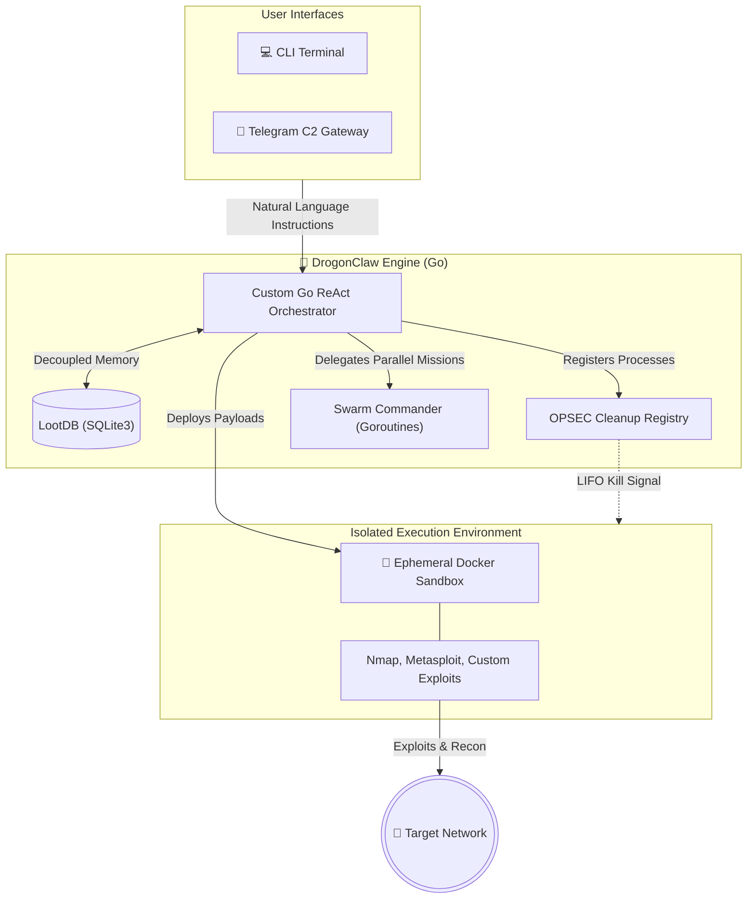
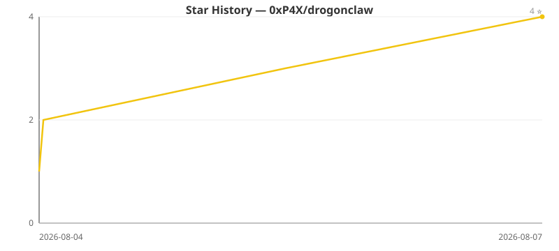

# DrogonClaw 🐉🔥

<div align="center">
  
</div>

> **AI-Driven Offensive Security Framework**
> 🌐 **Official Website**: [drogonclaw.xyz](https://drogonclaw.xyz)

DrogonClaw is a next-generation cyber operations platform. Rather than acting as a simple wrapper for Kali tools, DrogonClaw operates as a **Command-and-Control (C2) Brain**. It understands objectives, plans attack workflows, adapts to new discoveries, and orchestrates a swarm of specialized autonomous agents through a unified intelligence core.

DrogonClaw focuses on **high-confidence autonomous workflows**, explainable findings, and reproducible evidence, avoiding the hallucinations common in early AI security tools.

> [!WARNING]
> **Linux Only**
> DrogonClaw is strictly designed and optimized for **Linux-based operating systems** (such as Kali Linux, Ubuntu, or Debian). It relies heavily on Linux-specific networking APIs, native filesystem permissions, and process management. It will **not** function on Windows or macOS.

## 🏛️ Architectural Pillars



The platform revolves around three major pillars:

### 1. The Orchestration Core
- **Native Go ReAct Engine**: Hand-rolled, hyper-fast intelligence loop free from heavy Node.js/LangChain overhead.
- **Mission Planner**: Breaks down objectives, reasons about paths, and delegates to specialized agents.
- **Swarm Commander**: Automatically spins up native OS threads (Goroutines) to execute concurrent mission vectors in isolated contexts.
- **Intelligence Graph**: A persistent JSON-backed memory graph that stores typed entities such as targets, assets, ports, services, vulnerabilities, credentials, and flags, plus explicit relationships between them.

### 2. The Intelligence & Exploit Ecosystem
A modular Go-backed tool registry allowing the agent to perform highly complex attacks without hallucinating syntax:
- **Native Go Tool Wrappers**: Structured wrappers for common pentest tools (Nmap, Nuclei, Gobuster, FFUF, SQLMap, Subfinder, HTTPX, Checksec, Hydra, Forensics Triage) that eliminate flag-guesswork and provide pre-optimised defaults.
- **Verified Exploit Templates**: 10+ pre-compiled attack chains for critical vulnerabilities (EternalBlue, Log4Shell, PrintNightmare, MS08-067, Spring4Shell). Execution success depends on target vulnerability and environment; templates are verified against known vulnerable configurations, not guaranteed against all targets.
- **Active Directory Arsenal**: Native wrappers for impacket and BloodHound (Kerberoasting, Pass-the-Hash, DCSync) allowing the agent to pivot through Windows domains.
- **7-State Exploit Parser**: The AI doesn't just read raw output. A deterministic parser classifies every exploit attempt into one of 7 states (e.g., `SUCCESS_SHELL`, `PATCHED`, `FILTERED`, `WRONG_ARCH`) and feeds the exact recommended next step back to the reasoning engine.
- **Dual-Layer CVE Intelligence**: 
  - Dynamic local NVD cache indexing for the last 120 days of vulnerabilities.
  - Offline static database of the 100 most common CTF/pentest classic CVEs (vsftpd, dirtycow) for immediate recall.
- **Binary Triage**: Automated `checksec`, `strings`, `nm`, and `gdb` tools to feed binary context directly into the LLM context window.

### 4. The Cognitive Consciousness Loop
DrogonClaw no longer just blindly executes commands. It operates on a strict internal **Cognitive Loop** designed to catch logic flaws, correct its own mistakes, and act autonomously:
- **PERCEIVE / REFLECT / CHALLENGE / ACT**: Before every single tool execution, the AI explicitly evaluates the last output, hypothesizes why it failed, challenges its own assumptions (e.g., "Is there a 0-day here?"), and then acts.
- **Dual-Persona Commander/Civilian**: The AI acts as a ruthless Commander during execution, but switches to an inquisitive Civilian to pause and ask the operator for intuition when genuinely stuck via the `ask_operator` protocol.
- **Zero-Day Hunting**: Built-in `fuzz_endpoint` (ffuf integration) and `analyze_source_code` tools allow the agent to read raw source files and hunt for unpublished logic flaws, SQLi, and IDORs that no vulnerability scanner would ever catch.

### 5. Autonomous Execution & Safety Layer
DrogonClaw isolates operational risk and prevents unintended damage through:
- **Human-in-the-Loop (HitL)**: Dangerous actions (like installing arbitrary software, modifying network interfaces, or dropping high-risk payloads) physically halt execution and prompt the operator with a full impact analysis before proceeding.
- **Sandboxed Tool Execution**: Running command-line tools in isolated, ephemeral Docker environments.
- **Memory Failure Loops**: The agent tracks failed command syntax globally; if an exploit syntax fails, the agent is mathematically prevented from repeating that exact mistake, forcing it to pivot.

## 🚀 Quick Start & Setup Guide

DrogonClaw operates through multiple interconnected modules. You can run it locally from source, or install it globally as a standalone CLI tool.

### Installation (Source)

DrogonClaw operates outside of centralized registries to prevent censorship. It must be cloned directly from GitHub:

```bash
git clone https://github.com/0xP4X/drogonclaw.git
cd drogonclaw
go mod tidy
go build -o drogonclaw ./cmd/drogonclaw/
```

Once built, simply run `./drogonclaw` to launch the terminal interface.

*(Note: The legacy TypeScript/Node.js version is archived in the `legacy_v1/` directory for reference, but is no longer maintained.)*

### Installation (npm)

If you want the prebuilt Linux CLI from npm:

```bash
npm install -g drogonclaw
drogonclaw --help
```

This package publishes the Linux x64 executable only. Non-Linux platforms are intentionally blocked at install time.

### 3. Initialization Wizard

Upon the first launch of `drogonclaw`, the **DrogonClaw Configuration Wizard** will guide you through setting up your neural pathways. Designed with a sleek, premium terminal aesthetic:
- A security disclaimer is prominently displayed.
- You will be prompted to select an AI Provider (OpenAI, Anthropic, OpenRouter, or local Ollama) using interactive radio menus.
- You will securely enter your API keys.
- You can optionally configure a **Telegram Gateway** for remote mobile C2 operations.
- Graceful cancellations are supported natively—just hit `Ctrl+C` to abort setup safely.

If you ever need to reconfigure your setup, run `drogonclaw setup` or type `/setup` inside the interactive terminal.

### 4. Custom Help Menu

DrogonClaw ships with a custom, stylized help menu. Run `drogonclaw --help` to view all available commands, options, and operational examples, presented alongside our custom ASCII art.

### 5. Interactive Terminal & Dynamic Execution

Inside the `drogon>` prompt, you can converse with the AI naturally or use specific slash commands:
* `/skills` - Show loaded module categories and usage guidance
* `/skills <term>` - Search modules by name, description, category, or parameter
* `/skills <exact_name>` - Inspect a module's required parameters and execution backend
* `/status` - Print runtime state and memory graph entity/link counts
* `/health` - Run sandbox/toolkit diagnostics
* `/ctf <path>` - Offline local-CTF triage with artifact inventory and verified flag detection
* `/profile <target>` - Build a passive, source-accountable profile before any focused research
* `/setup` - Relaunch the configuration wizard
* `/clear` - Wipe the terminal screen

**Graceful Action Abortion:** If DrogonClaw is running a long scan or executing an exploit and you want to steer it in a different direction, simply press `Ctrl+C`. This will instantly sever the active thread, halt all sandboxed executions, and drop you back to the prompt, preserving the session memory so you can inject new instructions.

#### 📱 Telegram Gateway
Allows you to text instructions to your agent from your phone. It runs automatically if you set `TELEGRAM_TOKEN` and `TELEGRAM_CHAT_ID` in your configuration (`~/.drogonclaw/config.json`).
*Security Note: You must provide your `TELEGRAM_CHAT_ID` to whitelist your account, otherwise the agent will reject all commands.*

**Daemon Mode (Headless):** You can now run the agent entirely from your phone without the terminal UI blocking your screen.
```bash
./drogonclaw daemon
```

## 🛠️ Modularity & Swarm Intelligence

DrogonClaw is designed to scale into collaborative agent swarms. You can inject new specialized agents (e.g., a "Web Fuzzer Agent" or an "Active Directory Hound") without modifying the core orchestrator.

## ⚠️ Disclaimer

DrogonClaw is designed for **authorized security testing only**. Always ensure you have explicit permission before testing any system. Unauthorized access to computer systems is illegal.

## 📄 License

GNU AGPL v3

## 🌟 Star History

> **Note:** GitHub restricted access to star data on 2026-06-30, so the live
> star-history.com embed no longer renders. This chart is a **static SVG** generated
> from the repo owner's star timestamps (no public token). Regenerate it with:
>
> ```bash
> GITHUB_REPO=0xP4X/drogonclaw python3 scripts/star_history.py assets/star-history.svg
> ```
>
> See <https://star-history.com/blog/github-stargazer-api-restriction>.


