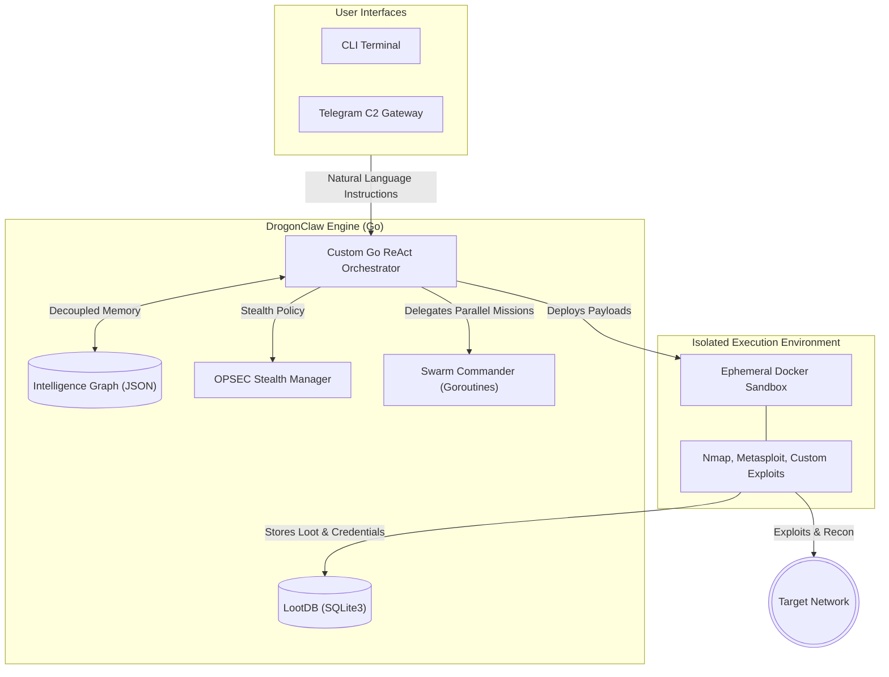

# DrogonClaw

<div align="center">
  
</div>

<div align="center">

[](https://github.com/0xP4X/drogonclaw/actions/workflows/CI-CD.yml)
[](LICENSE)
[](https://go.dev)
[](docs/INDEX.md)
[](docker-compose.yml)
[](SECURITY.md)

</div>

> **AI-Driven Offensive & Defensive Security Platform**
> **Official Website**: [drogonclaw.xyz](https://drogonclaw.xyz)

DrogonClaw is a next-generation cyber operations platform. Rather than acting as a simple wrapper for Kali tools, DrogonClaw operates as a **Command-and-Control (C2) Brain**. It understands objectives, plans attack workflows, adapts to new discoveries, and orchestrates a swarm of specialized autonomous agents through a unified intelligence core.

DrogonClaw focuses on **high-confidence autonomous workflows**, explainable findings, and reproducible evidence, avoiding the hallucinations common in early AI security tools.

[Quick Start](#quick-start) | [Supported Providers](#supported-providers) | [Architecture](#architectural-pillars) | [Commands](#interactive-terminal--commands) | [Development](#development) | [Setup Guide](docs/setup.md) | [Security](#security) | [Disclaimer](#disclaimer)

## Warning

> [!WARNING]
> **Linux Only**
> DrogonClaw is strictly designed and optimized for **Linux-based operating systems** (such as Kali Linux, Ubuntu, or Debian). It relies heavily on Linux-specific networking APIs, native filesystem permissions, and process management. It will **not** function on Windows or macOS.

## What Works

- **ReAct orchestration core** — a hand-rolled Go intelligence loop (no Node.js/LangChain overhead) that plans, delegates, and self-corrects.
- **Persistent intelligence graph** — a JSON-backed memory store of typed entities (targets, assets, ports, services, vulnerabilities, credentials, flags) and their relationships.
- **Sandboxed tool execution** — commands run in isolated, ephemeral Docker environments with a host fallback that fails closed.
- **Structured tool wrappers** — typed wrappers for Nmap, Nuclei, Gobuster, FFUF, SQLMap, Subfinder, HTTPX, Checksec, Hydra, and forensics triage.
- **Verified exploit templates** — pre-compiled chains for known CVEs (EternalBlue, Log4Shell, PrintNightmare, MS08-067, Spring4Shell), validated against known-vulnerable configurations.
- **Active Directory arsenal** — impacket and BloodHound wrappers (Kerberoasting, Pass-the-Hash, DCSync) for domain pivoting.
- **7-state exploit parser** — every exploit attempt is classified (e.g. `SUCCESS_SHELL`, `PATCHED`, `FILTERED`, `WRONG_ARCH`) and fed back to the reasoning engine.
- **Dual-layer CVE intelligence** — a rolling 120-day NVD cache plus an offline database of common CTF/pentest CVEs.
- **Human-in-the-Loop safety** — dangerous actions halt and require explicit operator approval.
- **Remote C2** — an optional Telegram gateway for mobile command and a headless daemon mode.

## Quick Start

### Requirements

- Go `1.26+`
- Docker (daemon running, for sandbox execution)

### Install (From Source)

DrogonClaw operates outside of centralized registries to prevent censorship. It must be cloned directly from GitHub:

```bash
git clone https://github.com/0xP4X/drogonclaw.git
cd drogonclaw
go mod tidy
go build -o drogonclaw ./cmd/drogonclaw/
```

Once built, run `./drogonclaw` to launch the terminal interface.

*(Note: The legacy TypeScript/Node.js version is archived in the `legacy_v1/` directory for reference, but is no longer maintained.)*

### Install (From npm)

If you want the prebuilt Linux CLI from npm:

```bash
npm install -g drogonclaw
drogonclaw --help
```

This package publishes the Linux x64 executable only. Non-Linux platforms are intentionally blocked at install time.

### Configure

On first launch, the **Configuration Wizard** guides you through provider selection and credential entry. Re-run it any time with `drogonclaw setup` or `/setup` inside the terminal.

**Fastest OpenAI setup (Linux/macOS):**

```bash
export OPENAI_API_KEY=sk-your-key-here
export AI_PROVIDER=openai
export AI_MODEL=gpt-4o
./drogonclaw
```

**Fastest local Ollama setup (Linux/macOS):**

```bash
export AI_PROVIDER=ollama
export OLLAMA_BASE_URL=http://localhost:11434
export AI_MODEL=llama3.1
./drogonclaw
```

### Start

```bash
./drogonclaw
```

Run `drogonclaw setup` first if you have not configured a provider yet.

### Daemon Mode (Headless)

Run the agent from your phone via the Telegram gateway without the terminal UI:

```bash
./drogonclaw daemon
```

## Supported Providers

| Provider | Config Key | Notes |
| --- | --- | --- |
| OpenRouter | `openrouter` | Flexible multi-model gateway; model list is fetched live with a curated fallback |
| NVIDIA NIM | `nvidia` | High-performance inference (Nemotron, Qwen, DeepSeek, Llama) |
| OpenAI | `openai` | Direct API runtime (`gpt-4o`, `gpt-4o-mini`) |
| Google Gemini | `gemini` | Enterprise reasoning core (`gemini-2.5-pro`, `gemini-2.5-flash`) |
| Ollama | `ollama` | Autonomous offline runtime; point `OLLAMA_BASE_URL` at your local server |

Provider credentials are stored locally in `~/.drogonclaw/config.json` (owner read/write only).

## Architectural Pillars



The platform revolves around five major pillars:

### 1. The Orchestration Core

- **Native Go ReAct Engine**: Hand-rolled, hyper-fast intelligence loop free from heavy Node.js/LangChain overhead.
- **Mission Planner**: Breaks down objectives, reasons about paths, and delegates to specialized agents.
- **Swarm Commander**: Automatically spins up native OS threads (Goroutines) to execute concurrent mission vectors in isolated contexts.
- **Intelligence Graph**: A persistent JSON-backed memory graph that stores typed entities such as targets, assets, ports, services, vulnerabilities, credentials, and flags, plus explicit relationships between them.

### 2. The Intelligence & Exploit Ecosystem

A modular Go-backed tool registry allowing the agent to perform highly complex attacks without hallucinating syntax:

- **Native Go Tool Wrappers**: Structured wrappers for common pentest tools (Nmap, Nuclei, Gobuster, FFUF, SQLMap, Subfinder, HTTPX, Checksec, Hydra, Forensics Triage) that eliminate flag-guesswork and provide pre-optimised defaults.
- **Verified Exploit Templates**: Pre-compiled attack chains for critical vulnerabilities (EternalBlue, Log4Shell, PrintNightmare, MS08-067, Spring4Shell). Execution success depends on target vulnerability and environment; templates are verified against known vulnerable configurations, not guaranteed against all targets.
- **Active Directory Arsenal**: Native wrappers for impacket and BloodHound (Kerberoasting, Pass-the-Hash, DCSync) allowing the agent to pivot through Windows domains.
- **7-State Exploit Parser**: The AI doesn't just read raw output. A deterministic parser classifies every exploit attempt into one of 7 states (e.g., `SUCCESS_SHELL`, `PATCHED`, `FILTERED`, `WRONG_ARCH`) and feeds the exact recommended next step back to the reasoning engine.
- **Dual-Layer CVE Intelligence**:
  - Dynamic local NVD cache indexing for the last 120 days of vulnerabilities.
  - Offline static database of the 100 most common CTF/pentest classic CVEs (vsftpd, dirtycow) for immediate recall.
- **Binary Triage**: Automated `checksec`, `strings`, `nm`, and `gdb` tools to feed binary context directly into the LLM context window.

### 3. User Interfaces

DrogonClaw is controlled through two primary interfaces:

- **CLI Terminal**: The interactive `drogon>` prompt with a stylized workspace, slash commands, and live operator feedback.
- **Telegram C2 Gateway**: A remote, mobile-friendly control channel that lets you issue natural-language instructions to the agent from your phone (see [Telegram Gateway](#telegram-gateway) for setup and whitelisting).

### 4. The Cognitive Consciousness Loop

DrogonClaw no longer just blindly executes commands. It operates on a strict internal **Cognitive Loop** designed to catch logic flaws, correct its own mistakes, and act autonomously:

- **PERCEIVE / REFLECT / CHALLENGE / ACT**: Before every single tool execution, the AI explicitly evaluates the last output, hypothesizes why it failed, challenges its own assumptions (e.g., "Is there a 0-day here?"), and then acts.
- **Dual-Persona Commander/Civilian**: The AI acts as a ruthless Commander during execution, but switches to an inquisitive Civilian to pause and ask the operator for intuition when genuinely stuck via the `ask_operator` protocol.
- **Zero-Day Hunting**: Built-in `fuzz_endpoint` (ffuf integration) and `analyze_source_code` tools allow the agent to read raw source files and hunt for unpublished logic flaws, SQLi, and IDORs that no vulnerability scanner would ever catch.

### 5. Autonomous Execution & Safety Layer

DrogonClaw isolates operational risk and prevents unintended damage through:

- **Human-in-the-Loop (HitL)**: Dangerous actions (like installing arbitrary software, modifying network interfaces, or dropping high-risk payloads) physically halt execution and prompt the operator with a full impact analysis before proceeding.
- **Sandboxed Tool Execution**: Running command-line tools in isolated, ephemeral Docker environments.
- **Memory Failure Loops**: The agent tracks failed command syntax globally; if an exploit syntax fails, the agent is mathematically prevented from repeating that exact mistake, forcing it to pivot.

## Interactive Terminal & Commands

Inside the `drogon>` prompt, you can converse with the AI naturally or use specific slash commands:

- `/skills` - Show loaded module categories and usage guidance
- `/skills <term>` - Search modules by name, description, category, or parameter
- `/skills <exact_name>` - Inspect a module's required parameters and execution backend
- `/status` - Print runtime state and memory graph entity/link counts
- `/health` - Run sandbox/toolkit diagnostics
- `/ctf <path>` - Offline local-CTF triage with artifact inventory and verified flag detection
- `/profile <target>` - Build a passive, source-accountable profile before any focused research
- `/setup` - Relaunch the configuration wizard
- `/clear` - Wipe the terminal screen

**Graceful Action Abortion:** If DrogonClaw is running a long scan or executing an exploit and you want to steer it in a different direction, simply press `Ctrl+C`. This will instantly sever the active thread, halt all sandboxed executions, and drop you back to the prompt, preserving the session memory so you can inject new instructions.

### Telegram Gateway

Allows you to text instructions to your agent from your phone. It runs automatically if you set `TELEGRAM_TOKEN` and `TELEGRAM_CHAT_ID` in your configuration (`~/.drogonclaw/config.json`).

*Security Note: You must provide your `TELEGRAM_CHAT_ID` to whitelist your account, otherwise the agent will reject all commands.*

## Modularity & Swarm Intelligence

DrogonClaw is designed to scale into collaborative agent swarms. You can inject new specialized agents (e.g., a "Web Fuzzer Agent" or an "Active Directory Hound") without modifying the core orchestrator.

## Development

DrogonClaw is a Go project. Use Go `1.26+` and have Docker available for sandbox execution.

```bash
make build        # build the binary for the current OS
make test         # run all Go tests with race detection
make lint         # run golangci-lint
make run          # build and launch the terminal interface
make daemon       # build and run in headless daemon mode
make docker-compose  # start core services via Docker Compose
```

Other useful targets: `make test-cover`, `make format`, `make vet`, `make skills` (regenerate the skill manifest), `make doctor` (system diagnostics), `make clean`.

### Repository Structure

- `cmd/drogonclaw/` - CLI entrypoint
- `internal/` - engine, agents, tools, TUI, sandbox, memory, and domain packages
- `docs/` - architecture and readiness documentation
- `scripts/` - build, manifest, and asset generation scripts
- `skills/` - executable module definitions
- `supabase/` - backend/schema assets
- `assets/` - logos and generated charts
- `tests/` - integration and fixture tests
- `.github/` - repo automation and funding metadata

## Security

DrogonClaw is built for authorized security testing only. Report suspected vulnerabilities in the project via [SECURITY.md](SECURITY.md). Never deploy offensive capabilities against networks without explicit written consent.

## Contributing

Contributions are welcome. For guidelines, the development workflow, and scope
rules, see [CONTRIBUTING.md](CONTRIBUTING.md). Ensure `make build`, `make lint`,
and `make test` pass before submitting a pull request.

## Disclaimer

DrogonClaw is designed for **authorized security testing only**. Always ensure you have explicit permission before testing any system. Unauthorized access to computer systems is illegal.

## License

GNU AGPL v3

## Star History

> **Note:** GitHub restricted access to star data on 2026-06-30, so the live
> star-history.com embed no longer renders. This chart is a **static SVG** generated
> from the repo owner's star timestamps (no public token). Regenerate it with:
>
> ```bash
> GITHUB_REPO=0xP4X/drogonclaw python3 scripts/star_history.py assets/star-history.svg
> ```
>
> See <https://star-history.com/blog/github-stargazer-api-restriction>.


